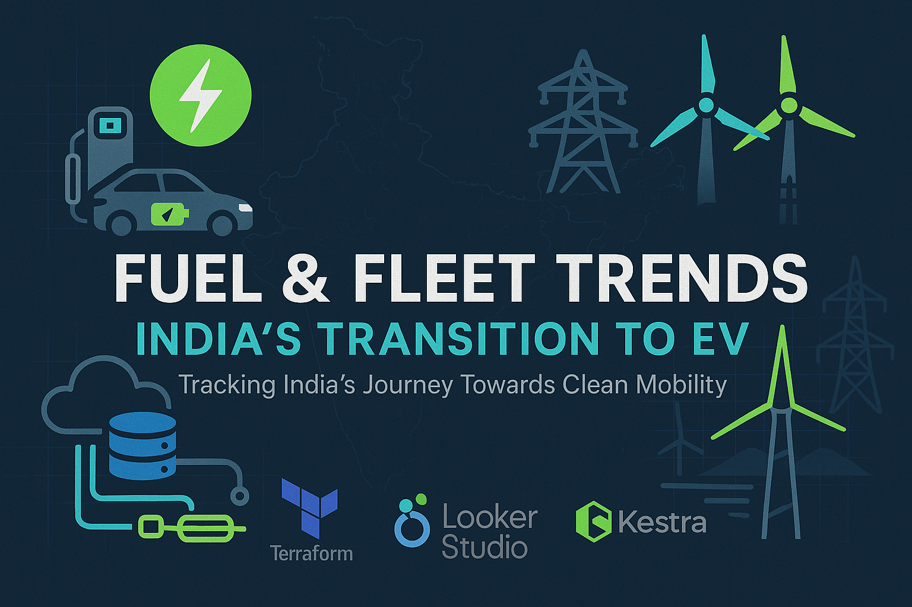
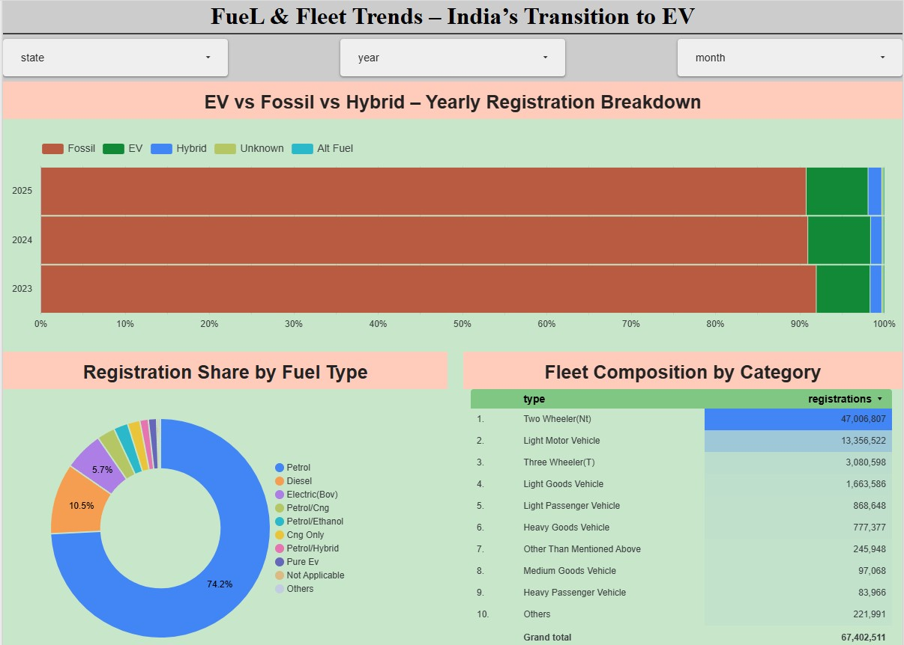

# Fuel & Fleet Trends – India’s Transition to EV
This project presents an end-to-end data pipeline that monitors and visualizes the rise of electric vehicles (EVs) in India. Using a cloud-native stack, it scrapes, stores, transforms, and visualizes vehicle registration trends across different fuel types and vehicle categories.

```bash
fuelnfleet-trends/
│
├── terraform/                              # Infrastructure as Code (Terraform)
│   ├── main.tf                             # GCP resources (VM, permissions)
│   └── variables.tf                        # Variables for project and region
│
├── kestra/                                 # Workflow orchestration (Kestra flows)
│   ├── docker-compose.yml                  # Docker setup to deploy Kestra
│   ├── gcp_kv.yml                          # GCP auth via Kestra secrets
│   ├── gcp_setup.yml                       # Upload flow to GCS/BigQuery
│   ├── scrape_vahan_registrations.yml
│   └── scrape_vahan_registrations_scheduled.yml  # Scheduled monthly ingestion
│
├── dbt/                                    # Data transformation using dbt
│   ├── dbt_project.yml
│   ├── profiles.yml
│   ├── models/                         # dbt models: cleaning, formatting, fact table
│   │   ├── staging/
│   │   │   ├── schema.yml
│   │   │   ├── stg_fuel_type_data.sql
│   │   │   └── stg_vehicle_category_data.sql
│   │   └── core/
│   │       ├── schema.yml
│   │       └── fact_registrations.sql    
│   └── macros/
│       ├── macros_properties.yml
│       ├── add_date.sql
│       └── titlecase.sql
│
└── README.md                               # Project overview & instructions
```
## Problem Statement
India is undergoing a major shift toward electric mobility. However, comprehensive insights into vehicle registrations by fuel type (EV, Fossil, Hybrid) remain fragmented. This project automates data collection, transformation, and visualization to enable policy makers, researchers, and industry professionals to track this transition seamlessly.

---
## Tech Stack

| Component               | Tool                         |
|------------------------|------------------------------|
| Cloud Provider          | Google Cloud Platform (GCP)  |
| Workflow Orchestration | Kestra                        |
| Infrastructure as Code | Terraform                    |
| Data Lake               | Google Cloud Storage (GCS)   |
| Data Warehouse          | BigQuery                     |
| Transformation Layer    | dbt                          |
| Dashboard               | Looker Studio                |
---

## Infrastructure Setup with Terraform

To provision the required cloud resources on Google Cloud Platform (GCP), Terraform is used to automate the creation of:

- A **Google Cloud Storage (GCS) bucket** to act as the data lake
- A **BigQuery dataset** to act as the data warehouse

### Files

- `main.tf`: Defines the GCP provider and resources (bucket & dataset)
- `variables.tf`: Contains all the configurable variables such as `project_id`, `bucket_name`, `dataset_name`, etc.

### Resources Provisioned

- `GCS Bucket`: `fuel_n_fleet_bucket`  
  - Class: `STANDARD`
  - Location: `US`
  - Auto-aborts incomplete multipart uploads older than 1 day
- `BigQuery Dataset`: `fuel_n_fleet`
  - Location: `US`

### How to Deploy

Before deploying, ensure you have:

- Enabled the necessary GCP APIs
- A service account JSON key with permissions (storage admin, bigquery admin, etc.)
- `my-creds.json` file at the root or update `variables.tf` accordingly

Run the following commands to deploy:

```bash
terraform init
terraform plan
terraform apply
```

## Data Ingestion Pipeline with Kestra

The ingestion pipeline is built using [Kestra](https://kestra.io/), an open-source data orchestration engine. The pipeline is deployed on a VM in Google Cloud and orchestrated through Docker.

### Setup

The Kestra server is deployed using Docker Compose:
- **Service 1**: `postgres` – used as the metadata repository for Kestra
- **Service 2**: `kestra` – main workflow engine

See `docker-compose.yml` in the `kestra/` directory for details.

### Flows

1. **`gcp_kv.yml`** – Defines and sets global variables (project ID, bucket, dataset) as key-value pairs.
2. **`gcp_setup.yml`** – Provisions GCS bucket and BigQuery dataset using the GCP plugin within Kestra itself (IaC within orchestration).
3. **`scrape_vahan_registrations.yml`** – Manually triggered flow for scraping registration data from the [Vahan Dashboard](https://vahan.parivahan.gov.in/vahan4dashboard/vahan/dashboardview.xhtml).
   - Accepts dynamic inputs (year, month, category, and method)
   - Allows both **sequential** and **parallel** scraping using Playwright + Python
   - Uploads CSV data to GCS
   - Stages data into external BigQuery tables
   - Merges clean data into warehouse tables with deduplication

4. **`scrape_vahan_registrations_scheduled.yml`** – A **scheduled monthly pipeline**
   - Triggered automatically on the 15th of every month for both vehicle category and fuel types
   - Fully automates scrape → GCS → BigQuery pipeline

### Workflow Design

Each flow follows these stages:
- Scrape dynamic web data with Playwright
- Clean and convert to tabular format with Pandas
- Upload to GCS as `.csv`
- Load as external table in BigQuery
- Transform and merge into curated fact tables (`fuel_type_data`, `vehicle_category_data`)

> Bonus: The ingestion is **parameterized** and **modular**, making it extendable to new data categories easily.

### Scheduling

The scheduled flow (`scrape_vahan_registrations_scheduled.yml`) includes two CRON triggers:
- Fuel type scraping → every 15th at 7 AM
- Vehicle category scraping → every 15th at 6 AM

## Data Transformation with dbt

The raw scraped data is cleaned, standardized, and modeled using [dbt](https://www.getdbt.com/) and loaded into **BigQuery**.

### Structure

- `models/staging/`: Fix inconsistencies in scraped data (column misalignments, formatting)
- `models/core/`: Unified fact table `fact_registrations` joining fuel & vehicle categories
- `macros/`: Custom logic for date parsing and title casing
- `tests/`: Data quality checks on key fields (e.g., uniqueness, not-null)

### Key Features

- Standardizes raw `fuel_type_data` and `vehicle_category_data`
- Adds a derived `reg_date` field via macro
- Ensures all `type` fields are title-cased
- Combines two domains (fuel + vehicle) into a unified fact model
- Includes **data quality tests**:
  - Not-null tests
  - Unique constraints
  - Accepted values for key fields

### Commands

To run the dbt project locally:

```bash
# Run all models
dbt run

# Run tests
dbt test

# Generate and view docs
dbt docs generate
dbt docs serve
```
### Configuration
Ensure your profiles.yml is correctly set up to point to BigQuery using a service account key.

```yaml
fuel_n_fleet:
  outputs:
    dev:
      type: bigquery
      method: service-account
      project: dtc-de-project-454809
      dataset: fuel_n_fleet
      location: US
      threads: 4
      keyfile: /absolute/path/to/your/my-creds.json
  target: dev
```
Test it out by running `dbt test`

## Dashboard – Fuel & Fleet Trends

The final insights are presented in an interactive **Looker Studio dashboard**, highlighting India's transition to Electric Vehicles (EVs) over time.

**Dashboard Link**: [FueL & Fleet Trends – Looker Studio](https://lookerstudio.google.com/s/rAG0qKiF7g4)



### Tiles Included

1. **EV vs Fossil vs Hybrid – Yearly Registration Breakdown**
   - Displays annual vehicle registration counts segmented by fuel type.
   - Highlights the growing share of EVs year-over-year.

2. **Registration Share by Fuel Type**
   - A categorical distribution showing percentage share of registrations across fuel types for a selected year/month.

3. **Fleet Composition by Category**
   - Breaks down the fleet by vehicle category: Transport vs Non-Transport.
   - Useful for understanding segment-wise adoption trends (e.g., EVs in commercial use).

### Insights

- **Clear trendline** toward increased EV adoption in recent years.
- **Hybrid vehicles** are still a small percentage but slowly growing.
- **Transport vehicles** have more consistent fuel-type trends, while **Non-Transport** shows quicker EV uptake.

> Dashboard is powered by clean data from BigQuery, transformed via dbt, and refreshed through a monthly Kestra pipeline.
